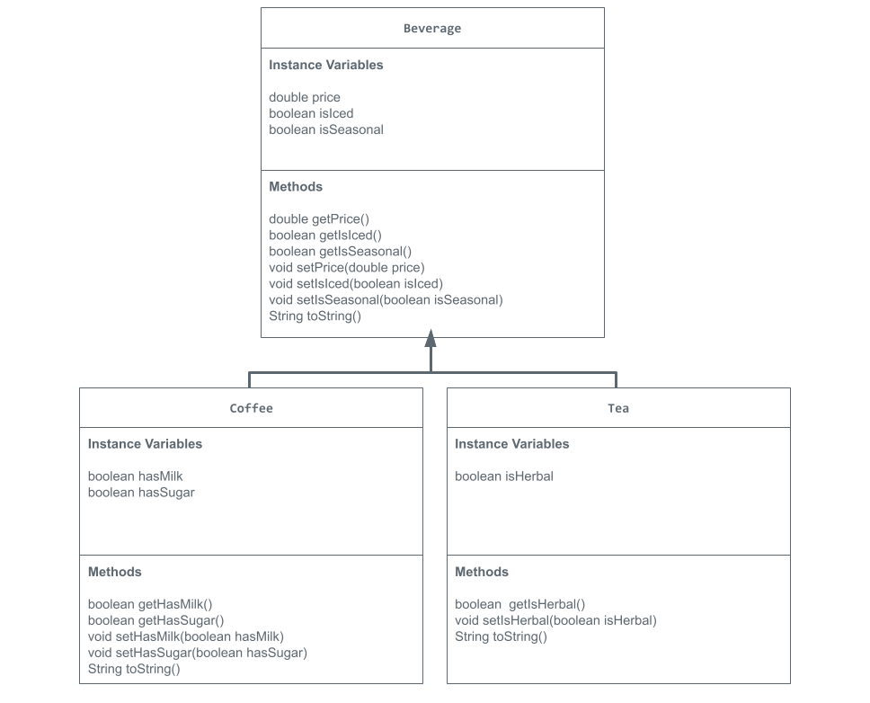

# Unit 2 - Store Management Project

## Introduction

You are opening a new business in your community! Businesses often need programs to manage the products and services they offer and track orders and requests from customers. Your goal is to create a store management system for your business.

## Requirements

Use your knowledge of object-oriented programming and class structure and design to create your store management system:
- **Create a class hierarchy** – Develop a superclass that represents a product or service your business offers and one or more subclasses that extend the superclass to represent more specific types of products or services.
- **Declare instance variables** – Declare instance variables in the superclass that are shared with the subclasses and instance variables in the subclasses that are not shared with the superclass.
- **Write constructors** – Write no-argument and parameterized constructors in the superclass and subclasses. Subclass constructors use the super keyword to call the superclass constructor.
- **Implement accessor and mutator methods** – Write accessor and mutator methods for instance variables that should be accessible and/or modifiable from outside of the class.
- **Implement a toString() method** – Write toString() methods in the superclass and subclasses that return information about the state of an object.

## UML Diagram

## Description

For my project, I decided on making a business that sells various beverages like a generic cafe or coffee shop. I chose this topic because I was unsure on what to make my project about (I'm not the most creative person ever), so I just chose the first topic that caught my eye when I was looking at the project ideas. The foundation of the project is the superclass, Beverage. This class represents any item the shop might sell as a drink. I used the instance variables of price, isIced, and isSeasonal to model common characteristics possesed by all drinks in the shop. The class contains a no-argument constructor for a default beverage and parameterized constructors to allow for different ways of instantiating a beverage object. For the methods, I included both accessor and mutator methods. This allows us to access and change the state of the objects. Finally, the toString method is used to provide a readable string that represents the object's state when it is printed. In my project I also included the subclasses Coffee and Tea which extend the Beverage class. This means that they inherit all the variables and non-private methods from Beverage. Each subclass also has their own instance variables to model unique characteristics. For the Coffee class, I included the variables hasMilk and hasSugar. For the Tea class, I included the variable isHerbal. I used both no-argument and parameterized constructors again for both of these classes. The super keyword allowed me to call the constructor of the parent class, Beverage, to initialize the inherited variables (price, isIced, isSeasonal). The Coffee class and Tea class include accessor and mutator methods as well. These classes also contain their own toString methods which use super.toString to call Beverage's toString method, combining the base beverage information (price, isIced, isSeasonal) with the more specific information (hasMilk, hasSugar, isHerbal). The final class I made was the tester class titled StoreRunner. This class contains the main method, which is the start point of the program. My tester class demonstrates the instantiation of many different objects of the superclass and subclasses using the constructors and prints their current state using the toString methods.
